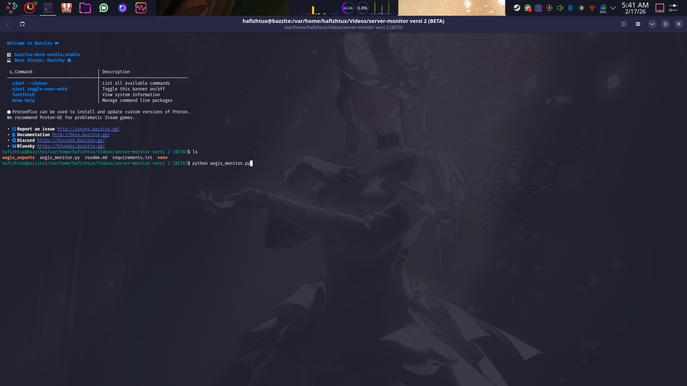
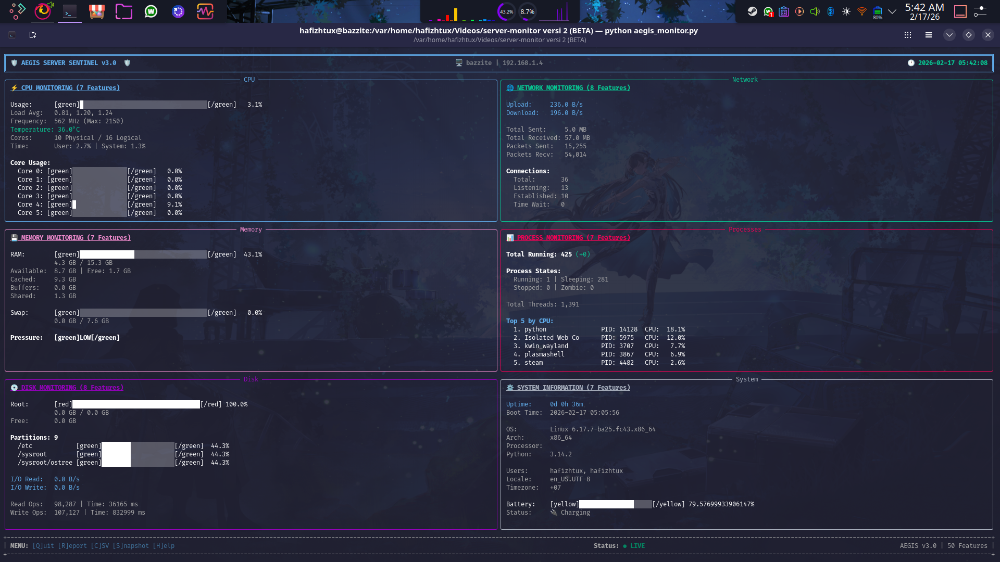

# 🛡️ AEGIS SERVER SENTINEL v3.0

<div align="center">


**Sistem Monitoring Resource Server Berbasis CLI dengan Notifikasi Real-Time**

*Aplikasi monitoring server paling lengkap dan estetik untuk terminal Anda*

</div>

---

## 📖 Daftar Isi

- [🌟 Fitur Utama](#-fitur-utama)
- [📋 50 Fitur Lengkap](#-50-fitur-lengkap)
- [🚀 Instalasi](#-instalasi)
- [💻 Cara Menggunakan](#-cara-menggunakan)
- [⌨️ Shortcut Keyboard](#️-shortcut-keyboard)
- [📁 Struktur Export](#-struktur-export)
- [🎨 Tampilan UI](#-tampilan-ui)
- [🔧 Konfigurasi](#-konfigurasi)
- [❓ Troubleshooting](#-troubleshooting)
- [📄 Lisensi](#-lisensi)

---

## 🌟 Fitur Utama

| Fitur | Deskripsi |
|-------|-----------|
| 🎯 **50 Fitur Monitoring** | CPU, Memory, Disk, Network, Process, System, Security |
| 🎨 **UI Estetik** | Tampilan terminal modern dengan warna dan progress bar |
| ⚡ **Real-Time Updates** | Refresh 2x per detik untuk data live |
| 🔔 **Smart Alerts** | Notifikasi WARNING & CRITICAL otomatis |
| 📊 **Trend Graphs** | Visualisasi grafik ASCII untuk CPU, RAM, Network |
| 🏥 **Health Score** | Skor kesehatan sistem 0-100 dengan analisis |
| 💾 **Multi Export** | JSON, CSV, dan Text Snapshot |
| 🔒 **Security Check** | 5-point security assessment |
| 📈 **Resource Forecast** | Prediksi penggunaan resource masa depan |
| 🎯 **User Friendly** | Menu interaktif dan dokumentasi lengkap |

---

## 📋 50 Fitur Lengkap

### 🖥️ CPU Monitoring (7 Fitur)

| # | Fitur | Deskripsi |
|:-:|-------|-----------|
| 1 | CPU Usage Total | Persentase penggunaan CPU keseluruhan |
| 2 | CPU Per Core | Penggunaan CPU per core individual |
| 3 | CPU Frequency | Frekuensi CPU (Current/Max/Min) |
| 4 | CPU Temperature | Suhu CPU (jika sensor tersedia) |
| 5 | CPU Cores | Jumlah core Physical & Logical |
| 6 | Load Average | Load average 1, 5, 15 menit |
| 7 | CPU Times | Waktu User, System, Idle |

### 💾 Memory Monitoring (7 Fitur)

| # | Fitur | Deskripsi |
|:-:|-------|-----------|
| 8 | RAM Usage % | Persentase penggunaan RAM |
| 9 | RAM Total/Used/Free | Detail kapasitas RAM |
| 10 | RAM Cached/Buffers | Memory cache dan buffer |
| 11 | RAM Shared | Shared memory |
| 12 | Swap Usage | Penggunaan swap (Total/Used/Free/%) |
| 13 | Memory Pressure | Skor tekanan memory (LOW/MEDIUM/HIGH) |
| 14 | Memory Pages | Page in/out statistics |

### 💿 Disk Monitoring (8 Fitur)

| # | Fitur | Deskripsi |
|:-:|-------|-----------|
| 15 | Disk Usage Root | Penggunaan disk partisi root |
| 16 | Disk Partitions | Detail semua partisi disk |
| 17 | Disk I/O Bytes | Total read/write bytes |
| 18 | Disk I/O Speed | Kecepatan read/write per detik |
| 19 | Disk I/O Operations | Jumlah operasi read/write |
| 20 | Disk I/O Time | Waktu operasi disk |
| 21 | Open Files | Jumlah file terbuka sistem |
| 22 | File Descriptors | Penggunaan file descriptor |

### 🌐 Network Monitoring (8 Fitur)

| # | Fitur | Deskripsi |
|:-:|-------|-----------|
| 23 | Network Bytes | Total bytes sent/received |
| 24 | Network Packets | Total packets sent/received |
| 25 | Network Speed | Upload/download speed per detik |
| 26 | Connections Total | Jumlah koneksi aktif |
| 27 | Connections Listen | Port yang sedang listening |
| 28 | Connections Established | Koneksi yang sudah established |
| 29 | Network Interfaces | Detail interface network |
| 30 | Network Latency | Ping latency ke gateway/DNS |

### 📊 Process Monitoring (7 Fitur)

| # | Fitur | Deskripsi |
|:-:|-------|-----------|
| 31 | Process Count | Total proses berjalan |
| 32 | Process Delta | Perubahan jumlah proses |
| 33 | Top 5 CPU | 5 proses dengan CPU tertinggi |
| 34 | Top 5 Memory | 5 proses dengan Memory tertinggi |
| 35 | Zombie Processes | Deteksi proses zombie |
| 36 | Process States | Status proses (Running/Sleeping/etc) |
| 37 | Total Threads | Jumlah thread keseluruhan |

### ⚙️ System Information (7 Fitur)

| # | Fitur | Deskripsi |
|:-:|-------|-----------|
| 38 | System Uptime | Waktu sistem aktif |
| 39 | Boot Time | Waktu boot terakhir |
| 40 | OS Information | Nama, versi, release, architecture |
| 41 | Python Version | Versi Python yang digunakan |
| 42 | Logged Users | User yang sedang login |
| 43 | Battery Status | Status baterai (jika ada) |
| 44 | Locale & Timezone | Setting locale dan timezone |

### 🔒 Security & Advanced (6 Fitur)

| # | Fitur | Deskripsi |
|:-:|-------|-----------|
| 45 | Environment Variables | Jumlah environment variables |
| 46 | Home Directory Space | Penggunaan disk home directory |
| 47 | Temp Directory Space | Penggunaan disk temp directory |
| 48 | Security Level | 5-point security assessment |
| 49 | Recent File Changes | File yang baru dimodifikasi |
| 50 | Resource Forecast | Prediksi penggunaan resource |

### 🎁 BONUS Features

| Fitur | Deskripsi |
|-------|-----------|
| 🏥 Health Score | Skor kesehatan sistem 0-100 |
| 🔔 Real-Time Alerts | Notifikasi WARNING & CRITICAL |
| 📈 Trend Graphs | Grafik ASCII untuk tren resource |
| 💾 Export JSON | Export laporan lengkap JSON |
| 📊 Export CSV | Export data format CSV |
| 📸 Snapshot | Export snapshot text |

---

## 🚀 Instalasi

### 📦 Prerequisites

Pastikan sistem Anda memiliki:

- **Python 3.8** atau lebih tinggi
- **pip** (Python package manager)
- **Terminal** dengan dukungan UTF-8

### 🔧 Langkah Instalasi

#### 1. Clone atau Download Repository

```bash
# Clone dari repository (jika ada)
git clone <repository-url>

# Atau download manual dan extract
```

#### 2. Masuk ke Direktori

```bash
cd server-monitor
```

#### 3. Install Dependencies

```bash
# Install semua dependencies yang dibutuhkan
pip install psutil rich

# Atau dengan requirements.txt (jika ada)
pip install -r requirements.txt
```

#### 4. Verifikasi Instalasi

```bash
# Cek apakah dependencies terinstall
python -c "import psutil; import rich; print('✅ Dependencies OK!')"
```

### 🐧 Instalasi di Berbagai OS

#### **Linux (Ubuntu/Debian)**

```bash
# Update package manager
sudo apt update

# Install Python3 dan pip
sudo apt install python3 python3-pip -y

# Install dependencies
pip3 install psutil rich

# Run aplikasi
python3 aegis_monitor.py
```

#### **Linux (Fedora/RHEL/Bazzite)**

```bash
# Install Python3 dan pip
sudo dnf install python3 python3-pip -y

# Install dependencies
pip3 install psutil rich

# Run aplikasi
python3 aegis_monitor.py
```

#### **macOS**

```bash
# Install Python (jika belum ada)
brew install python

# Install dependencies
pip3 install psutil rich

# Run aplikasi
python3 aegis_monitor.py
```

#### **Windows**

```bash
# Install Python dari python.org

# Install dependencies
pip install psutil rich

# Run aplikasi
python aegis_monitor.py
```

### 🐳 Docker (Opsional)

```bash
# Build Docker image
docker build -t aegis-monitor .

# Run container
docker run -it --rm --pid=host aegis-monitor
```

---

## 💻 Cara Menggunakan

### ▶️ Menjalankan Aplikasi

```bash
# Cara standar
python aegis_monitor.py

# Dengan Python3
python3 aegis_monitor.py

# Dengan path lengkap
python /path/to/aegis_monitor.py
```


### 🎮 Interface Overview

```
┌─────────────────────────────────────────────────────────────────┐
│  🛡️  AEGIS SERVER SENTINEL v3.0  🛡️                           │
│  🖥️  hostname | 192.168.1.100    🕐 2024-01-15 14:30:45       │
├─────────────────────────────────────────────────────────────────┤
│  ┌─────────────┐  ┌─────────────┐                              │
│  │    CPU      │  │   NETWORK   │                              │
│  │   Panel     │  │    Panel    │                              │
│  └─────────────┘  └─────────────┘                              │
│  ┌─────────────┐  ┌─────────────┐                              │
│  │   MEMORY    │  │   PROCESS   │                              │
│  │   Panel     │  │    Panel    │                              │
│  └─────────────┘  └─────────────┘                              │
│  ┌─────────────┐  ┌─────────────┐                              │
│  │    DISK     │  │   SYSTEM    │                              │
│  │   Panel     │  │    Panel    │                              │
│  └─────────────┘  └─────────────┘                              │
├─────────────────────────────────────────────────────────────────┤
│  MENU: [Q]uit [R]eport [C]SV [S]napshot [H]elp                 │
│  Status: ● LIVE          AEGIS v3.0 | 50 Features              │
└─────────────────────────────────────────────────────────────────┘
```


### ⌨️ Shortcut Keyboard

| Tombol | Fungsi | Deskripsi |
|--------|--------|-----------|
| `Q` | Quit | Keluar dari aplikasi |
| `R` | Report | Export laporan JSON lengkap |
| `C` | CSV | Export data format CSV |
| `S` | Snapshot | Export snapshot text |
| `H` | Help | Tampilkan menu bantuan |
| `Ctrl+C` | Exit | Keluar darurat dari aplikasi |

### 📁 Struktur Export

Semua file export disimpan di folder `aegis_exports/`:

```
aegis_exports/
├── aegis_report_20240115_143045.json    # Laporan JSON lengkap
├── aegis_data_20240115_143045.csv       # Data format CSV
└── aegis_snapshot_20240115_143045.txt   # Snapshot text
```

#### 📄 Contoh JSON Report

```json
{
  "timestamp": "2024-01-15T14:30:45",
  "hostname": "server01",
  "health_score": 85,
  "metrics": {
    "cpu_percent": 25.5,
    "ram_percent": 45.2,
    "disk_percent": 60.1
  },
  "alerts": [...],
  "history": {...}
}
```

---

## 🎨 Tampilan UI

### 🏥 Health Score Indicator

| Score | Status | Warna |
|-------|--------|-------|
| 80-100 | ✅ EXCELLENT | 🟢 Hijau |
| 60-79 | ⚠️ GOOD | 🟡 Kuning |
| 0-59 | 🚨 CRITICAL | 🔴 Merah |

### 🔔 Alert Levels

| Level | Indikator | Kondisi |
|-------|-----------|---------|
| CRITICAL | 🔴 | CPU > 90%, RAM > 90%, Disk > 95%, Temp > 85°C |
| WARNING | 🟡 | CPU > 70%, RAM > 75%, Disk > 80%, Temp > 70°C |
| NORMAL | 🟢 | Semua resource dalam batas aman |

### 📈 Trend Graphs

```
📈 CPU Trend (Last 30s):
│██████    │
│███████   │
│████████  │
│█████████ │
│██████████│

📈 RAM Trend (Last 30s):
│████      │
│█████     │
│██████    │
│███████   │
│████████  │
```

---

## 🔧 Konfigurasi

### ⚙️ Threshold Settings

Edit bagian `self.thresholds` di dalam kode untuk menyesuaikan alert threshold:

```python
self.thresholds = {
    'cpu_warn': 70,      # Warning CPU %
    'cpu_crit': 90,      # Critical CPU %
    'ram_warn': 75,      # Warning RAM %
    'ram_crit': 90,      # Critical RAM %
    'disk_warn': 80,     # Warning Disk %
    'disk_crit': 95,     # Critical Disk %
    'temp_warn': 70,     # Warning Temperature °C
    'temp_crit': 85,     # Critical Temperature °C
    'conn_warn': 1000,   # Warning Connections
    'conn_crit': 5000,   # Critical Connections
    'proc_warn': 300,    # Warning Processes
    'proc_crit': 500     # Critical Processes
}
```

### 🎨 Color Customization

Warna dapat disesuaikan di fungsi `_create_progress_bar()`:

```python
def _create_progress_bar(self, percent, width=30, color="blue"):
    if percent > 90:
        color = "red"      # Critical threshold
    elif percent > 70:
        color = "yellow"   # Warning threshold
    else:
        color = "green"    # Normal
```

---

## ❓ Troubleshooting

### 🐛 Error: `name 'tempfile' is not defined`

**Solusi:** Tambahkan import di bagian atas file

```python
import tempfile
```

### 🐛 Error: `ModuleNotFoundError: No module named 'psutil'`

**Solusi:** Install dependencies

```bash
pip install psutil rich
```

### 🐛 Error: `Permission Denied`

**Solusi:** Jalankan dengan sudo (untuk akses sensor hardware)

```bash
sudo python aegis_monitor.py
```

### 🐛 Error: `CPU Temperature N/A`

**Penjelasan:** Sensor suhu tidak tersedia di sistem Anda (normal di VM/container)

**Solusi:** Tidak perlu diperbaiki, fitur akan tetap bekerja tanpa suhu

### 🐛 Error: `Terminal terlalu kecil`

**Solusi:** Perbesar ukuran terminal atau gunakan fullscreen (F11)

**Minimum ukuran terminal:** 120x40 karakter

### 🐛 Error: `Unicode Encode Error`

**Solusi:** Set locale UTF-8

```bash
export PYTHONIOENCODING=utf-8
python aegis_monitor.py
```

---

## 📊 System Requirements

| Komponen | Minimum | Recommended |
|----------|---------|-------------|
| Python | 3.8+ | 3.10+ |
| RAM | 512 MB | 1 GB+ |
| Storage | 50 MB | 100 MB+ |
| Terminal | 80x24 | 120x40+ |
| OS | Linux/macOS/Windows | Linux |

---

## 🤝 Kontribusi

Kami menerima kontribusi! Cara berkontribusi:

1. Fork repository
2. Buat feature branch (`git checkout -b feature/AmazingFeature`)
3. Commit perubahan (`git commit -m 'Add AmazingFeature'`)
4. Push ke branch (`git push origin feature/AmazingFeature`)
5. Buka Pull Request

---

## 📄 Lisensi

Distribusikan di bawah lisensi **MIT License**. Lihat `LICENSE` untuk informasi lebih lanjut.

---

## 📞 Support

| Platform | Link |
|----------|------|
| 📧 Email | hafizhnezuko@gmail.com |
| 💬 Discord | [Join Server](#) |
| 🐛 Issues | [GitHub Issues](#) |
| 📖 Wiki | [Documentation](#) |

---

## 🙏 Acknowledgments

- **[psutil](https://github.com/giampaolo/psutil)** - Library untuk sistem monitoring
- **[Rich](https://github.com/Textualize/rich)** - Library untuk UI terminal yang cantik
- **Community** - Terima kasih untuk semua contributor

---

<div align="center">

### 🛡️ Dibuat dengan ❤️ untuk System Administrator

**AEGIS SERVER SENTINEL v3.0** | 50 Fitur | Real-Time Monitoring

[⬆️ Kembali ke Atas](#-aegis-server-sentinel-v30)

</div>
